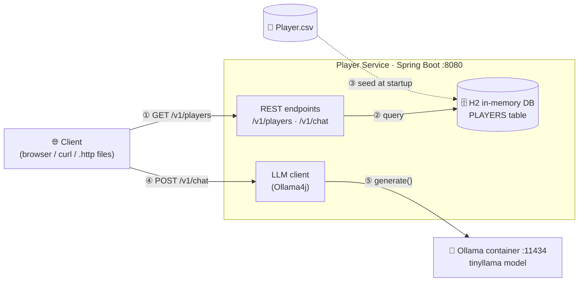
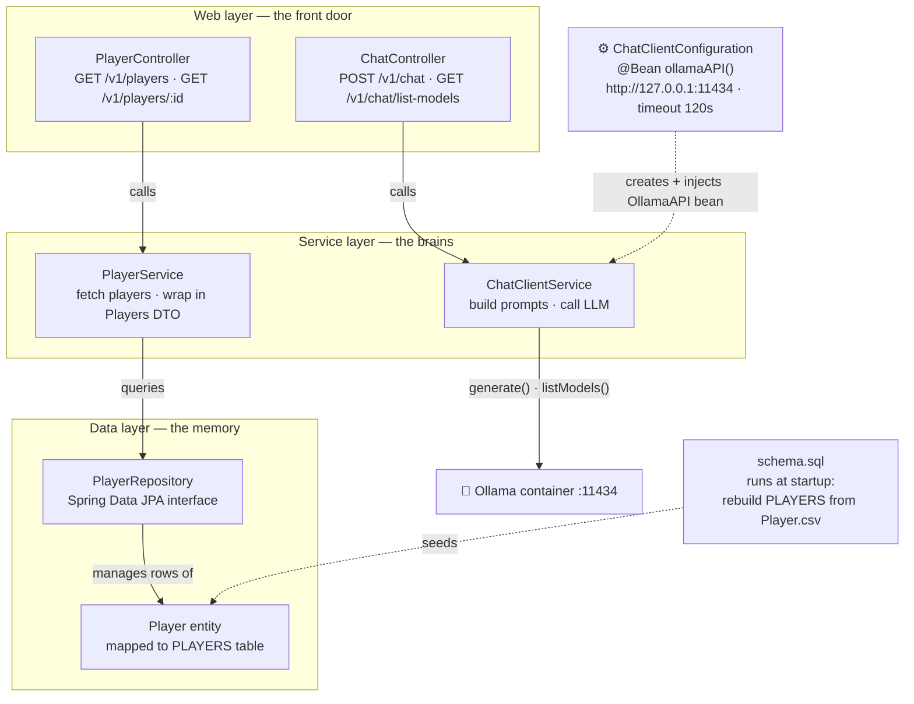
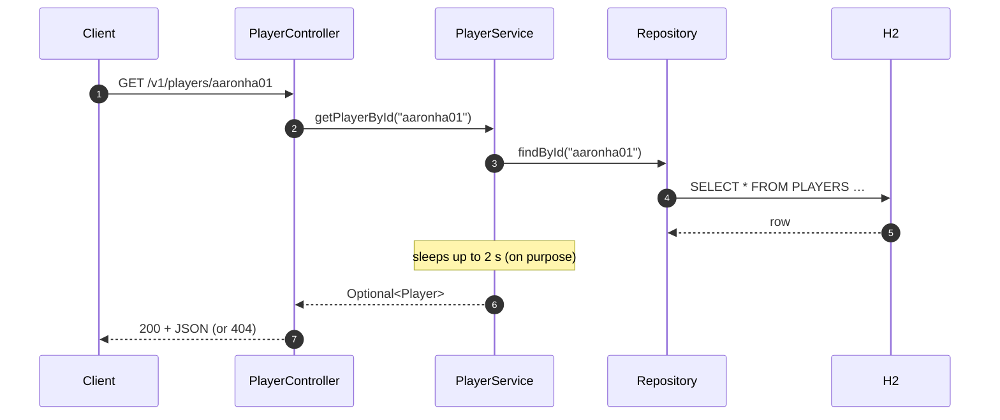
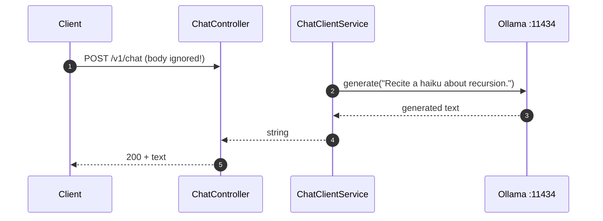
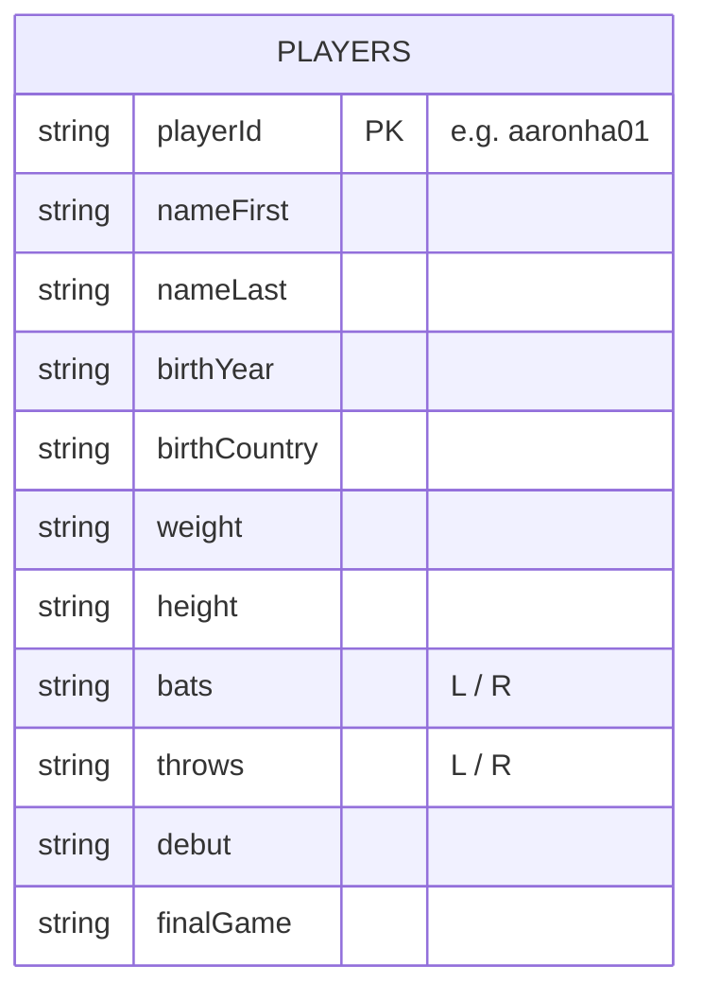

# Player Service — Architecture

> **In one sentence:** a Spring Boot REST API that serves baseball player data from an in-memory database and forwards chat requests to a locally-running LLM (Ollama · `tinyllama`) — plus an optional Python sidecar for ML team recommendations.

---

## 1. The big picture

Everything runs on your machine. There are three moving parts: **the Java API**, **its in-memory database**, and **the Ollama LLM container**. A fourth piece (the Python ML service) runs separately and nothing in the Java code calls it.



| Step | What happens |
|---|---|
| ①–③ | Player data lives only in `Player.csv`. At startup it is loaded into H2, and every read request hits that table. |
| ④–⑤ | Chat requests leave the app entirely and are forwarded to Ollama, which generates text with `tinyllama`. |
| — | The Python service on `:5000` is a standalone extra — clients may call it directly, but the Java app never does. |

---

## 2. Building blocks

The Java app follows a classic three-layer Spring layout. Each layer has one job:



### Who does what

| Block | File | Plain-language job |
|---|---|---|
| **PlayerController** | `controller/PlayerController.java` | Answers "give me all players" and "give me player X". Returns JSON; returns `404` when a player doesn't exist. |
| **ChatController** | `controller/chat/ChatController.java` | Thin pass-through for anything LLM-related. |
| **PlayerService** | `service/PlayerService.java` | Talks to the repository. Adds a random ≤2 s delay on single-player lookups (simulated latency). Any error becomes an empty result → `404`, never a crash. |
| **ChatClientService** | `service/chat/ChatClientService.java` | Owns the Ollama conversation. Today it always sends the fixed prompt *"Recite a haiku about recursion."* to `tinyllama` and ignores the request body. |
| **ChatClientConfiguration** | `config/ChatClientConfiguration.java` | Builds the single `OllamaAPI` bean everyone shares. Also registers a `RestTemplate` bean that nobody currently uses. |
| **PlayerRepository** | `repository/PlayerRepository.java` | An empty interface — Spring Data JPA gives it `findAll()`, `findById()`, etc. for free. |
| **Player / Players** | `model/` | `Player` = one database row (all fields are strings). `Players` = just a list wrapper for the collection response. |
| **schema.sql** | `resources/schema.sql` | The seeder. Drops and recreates the `PLAYERS` table straight from the CSV on every boot. |

---

## 3. Life of a request

### Fetching players



Example response body (from `Player.csv`):

```json
{
  "playerId": "aaronha01",
  "birthYear": "1934",
  "firstName": "Hank",
  "lastName": "Aaron",
  "weight": "180",
  "height": "72",
  "bats": "R",
  "debut": "1954-04-13"
}
```

> `GET /v1/players` works identically but returns **every** row wrapped as `{ "players": [ … ] }`.

### Chatting with the LLM



Requires the Ollama container to be running (`docker run -d -p 11434:11434 ollama/ollama` + pull `tinyllama`) or these endpoints fail with connection errors.

---

## 4. API reference

### Player Service · `:8080`

| Method & path | Returns | Notes |
|---|---|---|
| `GET /v1/players` | All players | Wrapped in `{ "players": [...] }` |
| `GET /v1/players/{id}` | One player | `404` if missing or if anything goes wrong |
| `POST /v1/chat` | LLM text | Body ignored; fixed tinyllama haiku prompt |
| `GET /v1/chat/list-models` | Installed models | Proxies Ollama's local registry |

Ready-to-run requests live in [`collection/`](collection/) (`.http` files + `chat_requests.txt`).

### Python ML service · `:5000` *(optional, standalone)*

| Method & path | Purpose |
|---|---|
| `POST /team/generate` | Given a `seed_id` (or raw features) + `team_size`, returns similar players via nearest-neighbor model |
| `POST /team/feedback` | Thumbs-down a member (`feedback: -1`) so future teams exclude them |
| `POST /llm/generate` · `/llm/feedback` | Placeholder stubs, not yet implemented |

Details live in [`player-service-model/README.md`](player-service-model/README.md).

---

## 5. The data model

One table. Everything is stored as strings because the CSV is the source of truth.



<details>
<summary>Full field list</summary>

The table also carries death info, birth city/state, given name, retroID, bbrefID:
`deathYear, deathMonth, deathDay, deathCountry, deathState, deathCity, birthMonth, birthDay, birthState, birthCity, nameGiven, retroId, bbrefId`
</details>

**How seeding works:** Hibernate is told *not* to create tables (`ddl-auto: none`). Instead, at startup `schema.sql` executes:

```sql
DROP TABLE IF EXISTS PLAYERS;
CREATE TABLE PLAYERS AS SELECT * FROM CSVREAD('Player.csv');
```

Restart the app → fresh copy of the CSV. Stop the app → data gone. Nothing is ever written back.

---

## 6. Configuration cheat sheet (`application.yml`)

| Setting | Value | Why you care |
|---|---|---|
| Port | `8080` | Base URL for every endpoint |
| Database URL | `jdbc:h2:mem:playerdb` | In-memory → wiped on shutdown |
| Credentials | user `sa`, empty password | For browsing via the H2 console |
| H2 console | enabled | Visit `/h2-console` while the app runs to inspect data |
| Schema management | `ddl-auto: none` | `schema.sql` owns the schema, not Hibernate |

---

## 7. Gotchas worth knowing

- **Stateless & ephemeral** — both services lose everything on restart (Java re-seeds from CSV; the Python feedback memory resets).
- **Read-only API** — no create/update/delete endpoints exist.
- **Chat prompt is hard-coded** — sending a different body changes nothing until `ChatClientService` is extended.
- **Built-in slowness** — single-player fetches intentionally sleep up to ~2 s; the Python team generator randomly fails (~1 %) or stalls ~6 s. These simulate flaky networks on purpose.
- **Errors hide as 404s** — `getPlayerById` swallows exceptions into "not found"; there's no global error handler.

## 8. Natural next steps

1. Accept a custom prompt/model in `POST /v1/chat` (extend `ChatClientService`).
2. Call the Python ML service from Java (add a REST client config) and expose it under `/v1`.
3. Add write support + a global exception handler.
